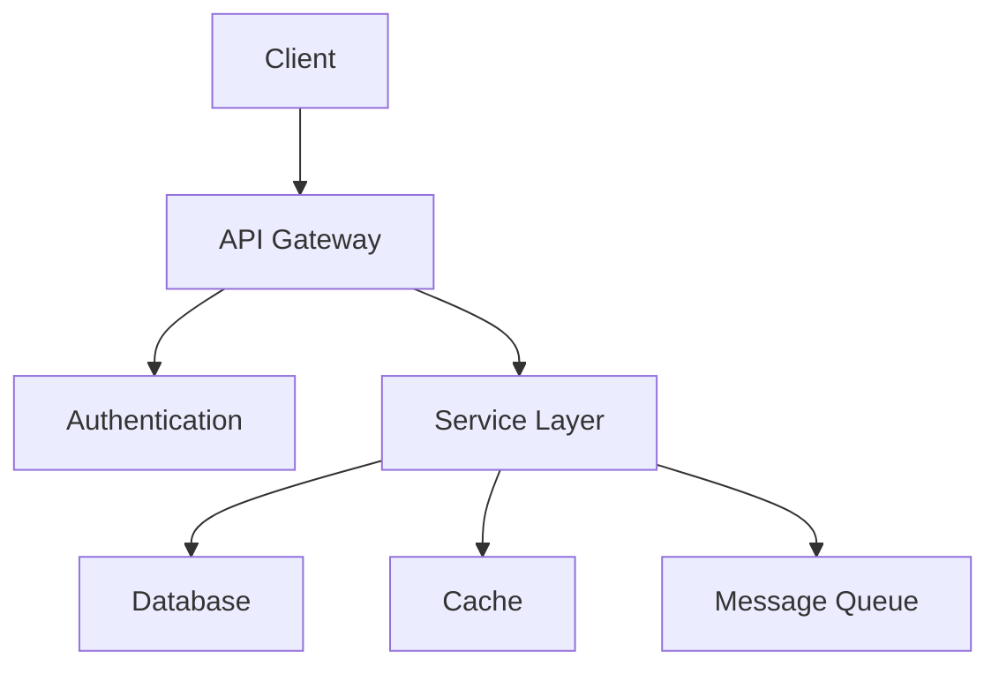

```markdown
# Architecture Overview

Understanding the platform's architecture and design principles.

## System Architecture



## Components

### API Gateway
- Request routing
- Load balancing
- Rate limiting
- SSL termination

### Service Layer
- Business logic
- Data validation
- Event processing
- Resource management

### Data Storage
- Primary database
- Cache layer
- File storage
- Message queues

## Design Principles

1. **Microservices**
   - Independent services
   - Loose coupling
   - Service discovery

2. **Event-Driven**
   - Asynchronous processing
   - Event sourcing
   - CQRS pattern

3. **Scalability**
   - Horizontal scaling
   - Load distribution
   - Resource optimization
```

